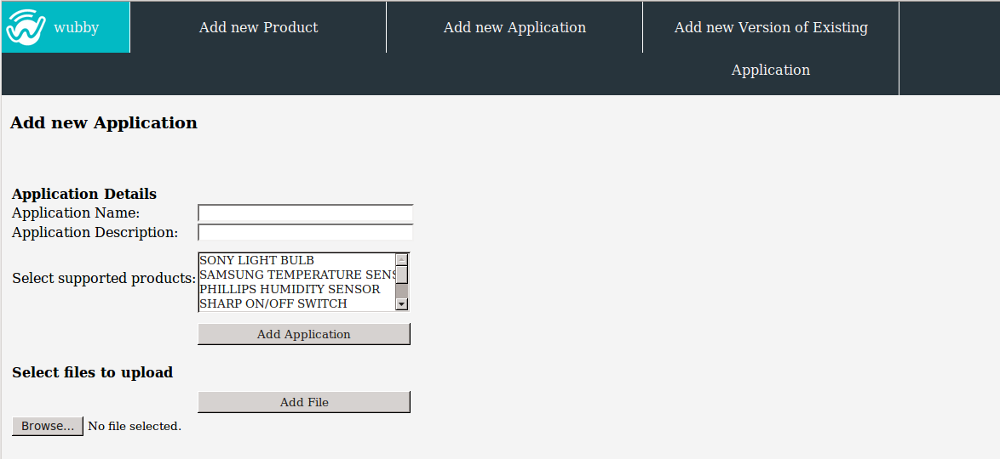

.. _admin:

************************
Administrator Operations
************************

The *Administrator* of the wubby cloud can perform the following actions:

- :ref:`addProduct`
- :ref:`addApp`
- :ref:`addVersion`

.. note: In future versions *adding an application* and *adding a new version of an existing application* operations will be part of the *developer* role.

.. _addProduct:

Add a product
==================

From this page the Administrator adds supported commercial products where wubby applications can run. A *"product"* refers to the device that consists of a wubby enabled embedded platform. For example, the Broadcom WICED platform, which is wubby enabled, can be part of several commercial products.
Examples of such products can be a *SONY light bulb*, a *Samsung temperature sensor*, a *Philips humidity sensor*, etc. 

.. note:: The *"product"* term is actually used in the wubby Cloud to categorize the several devices used by customers.

The product name should be unique. A default application should be added for each newly registered product. The name of the application refers to the folder that contains all the files that the application consists of and should be unique, too. 

For each file the application consists of, the user has to press *"Add file"* and browse on his local filesystem to find and upload the corresponding file.

   
   *Adding a new product into the wubby cloud*

.. _addApp:

Add an application
==================

Every developer that has created a python application for a wubby enabled device can upload it on the wubby cloud, using the wubby Client. Through the wubby Client: 

a) The developer can easily update his device so that it starts running the newly created application, 

b) Other users, owners of the same device, can purchase the application and install it into their device, too. 

Refer to section ":ref:`browseApps`" for detailed description on the install/update process of a wubby device.

The figure below shows the "Add new Application" form. The developer has to enter a unique name for his application. The application name refers to the folder that contains all the files that the application consists of.

From the "supported products" list, the developer can select one or more products with which the uploaded application is compatible.

For each file the application consists of, the developer has to press *"Add file"* and browse on his local filesystem to find and upload the corresponding file.

   
   *Adding a new application into the wubby cloud*

.. _addVersion:

Add a new version of an existing application
============================================

Except for adding new applications, a developer can update existing applications by adding new versions.

The figure below shows the corresponding form. When adding a new version a name is produced automatically, instead of giving a totally new one. The format is : <applicationName v version_number>, for example :file:`application1 v2`.

The developer has to select the supported products and add the files of the application (same procedure as in :ref:`addApp`).

   
   *Adding a new version of an existing application into the wubby cloud*

