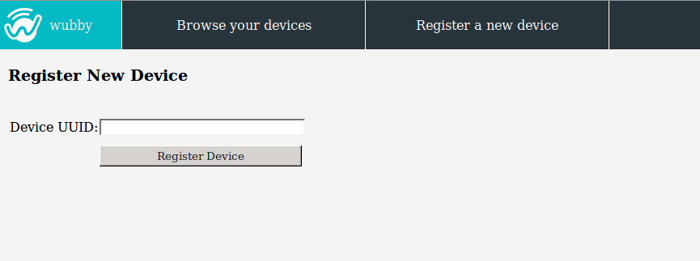
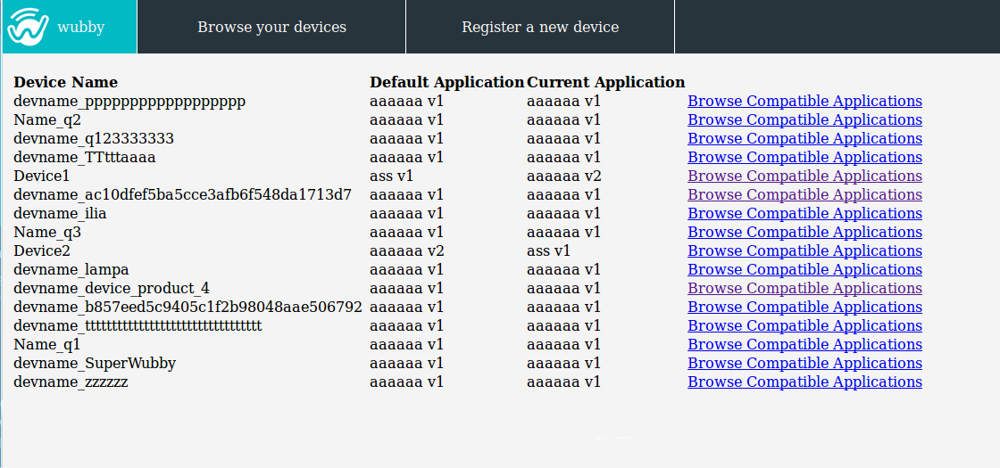
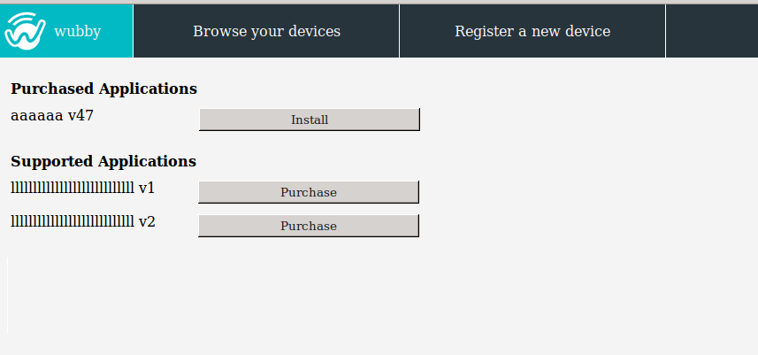
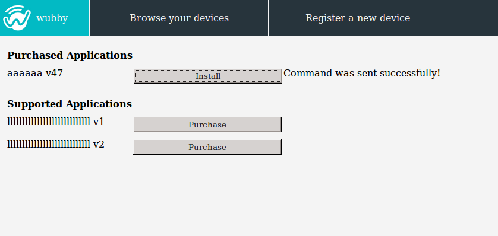

.. _customer:

*******************
Customer operations
*******************

.. _registerDev:

Register a new device
=====================

.. note:: The *"device"* refers to a commercial wubby enabled product that a user has aquired (for example a *SONY light bulb*). See section ":ref:`addProduct` for more information on how *products* are added in the wubby cloud.

Any wubby enabled device runs a default application. To update the device and install other applications on it, the device has to be registered on the wubby Cloud, using the *uuid* number which lies on an exposed spot on the device. When the device gets registered it is presented in the wubby Client with its name, which has the format: <devname_*uuid*>, for example *devname_46cb01c6ff781756d76636e7f210ecfe*

.. _browseDev:

Browse  devices
===================

Through the wubby Client a customer has an overview of all his registered devices, as well as the applications he has aquired and all the compatible applications (see next paragraph, :ref:`browseApps`).

.. _browseApps:

Browse compatible applications
------------------------------

All the available applications compatible with a wubby enabled device are presented when selecting this option, as shown in the figure below.  As one can see, they are devided into two categories: *"purchased"* and *"supported applications"*. The *"purchased applications"* are the ones that can be selected to be set as the running application of the device. The *"supported applications"* have first to be purchased before the user installs them on the device.

.. _installApps:

Install application on device
------------------------------

The installation of an application on a wubby enabled device is very easy: just press "Install" as shown in the figure below.
  

.. note:: The *"purchase"* option will be available soon.
