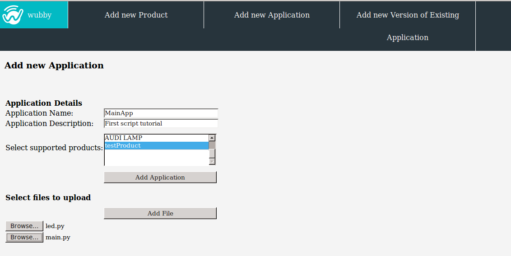
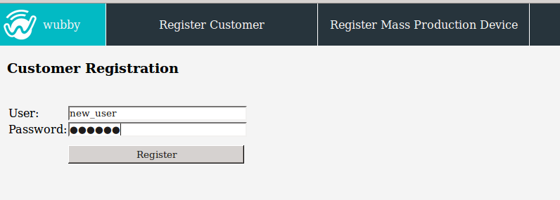
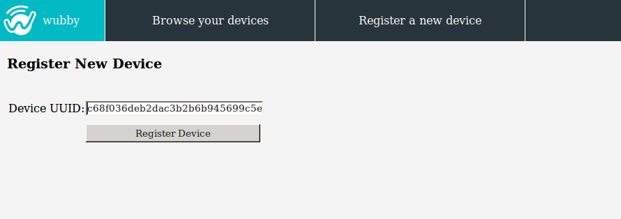
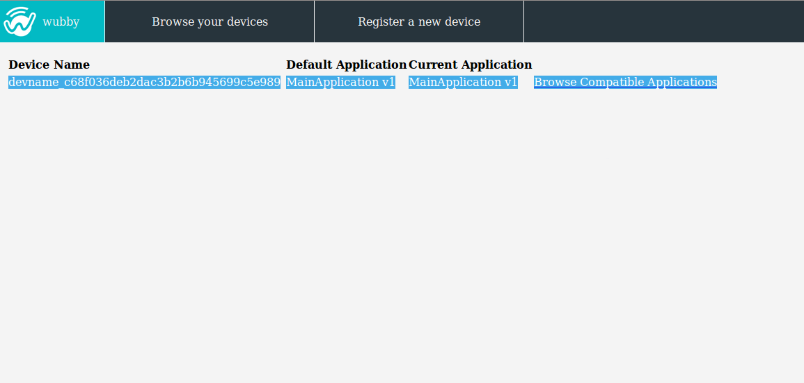
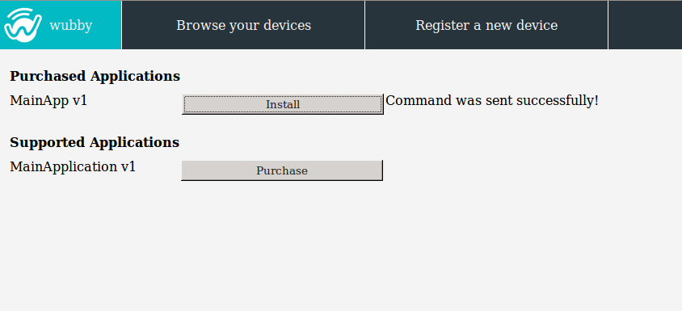

.. _exampleProcess:

*******************************************************************
An example of the application update process using the wubby Client
*******************************************************************

In this example we will add the application created in the ":ref:`tutorial`" section and we will set it as the running application of our device.

**Step 1: Add a new application**

- Login as *admin*.

- In the *"Add new Application"* form insert the application name and the corresponding files. In this example we have added an application with the "MainApp" name that can run only on "testProduct" products. The files of the application are the :file:`led.py` and :file:`main.py`.

**Step 2: Register yourself**

**Step 3: Register your device**

- Find the *uuid* placed on the device.
- Login with your username and password.
- Select *"Register a new device"* and enter the *uuid* of the device.

**Step 4: Install the application**

- Select *"Browse your devices"*. In the list you will find the newly registered device, which will have a default running application (see ":ref:`addProduct`" section for more details on how the default application is assigned).

- Select *"Browse Compatible Applications"*. You will find the "MainApp v1" in the list of the supported applications. Press *"Purchase"* and the "MainApp v1" will move to the list with the purchased applications. 

- Install the application to the device by pressing *"Install"*.

- The device will receive the command to update its running application and as soon as it downloads the application files, it will start running it.

