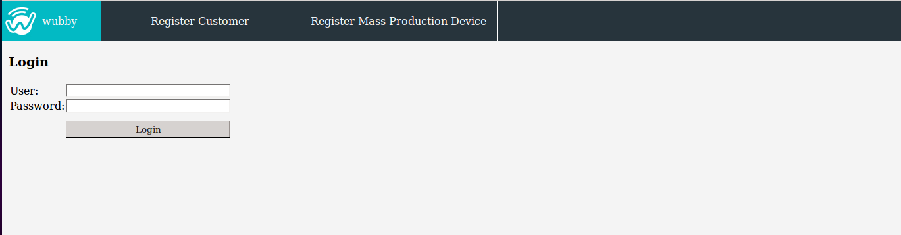

.. _main_page:

Login page
==========

The figure below shows the login page of the wubby Client.

.. _figlogin:

   
   *Login page*
   

The first time a user accesses the wubby Cloud he has to register himself, by selecting the *"Register Customer"* option. 

The *"Register Mass Production Device"* option is used to register a newly produced wubby enabled device.

